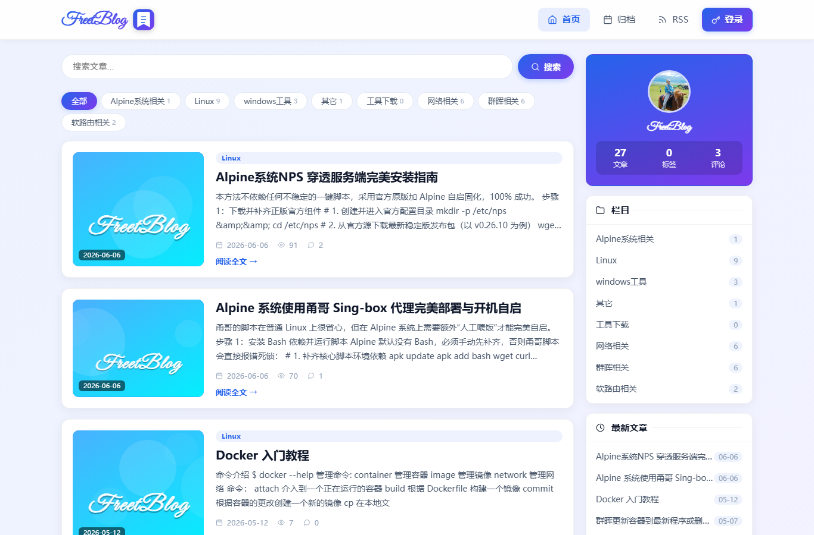
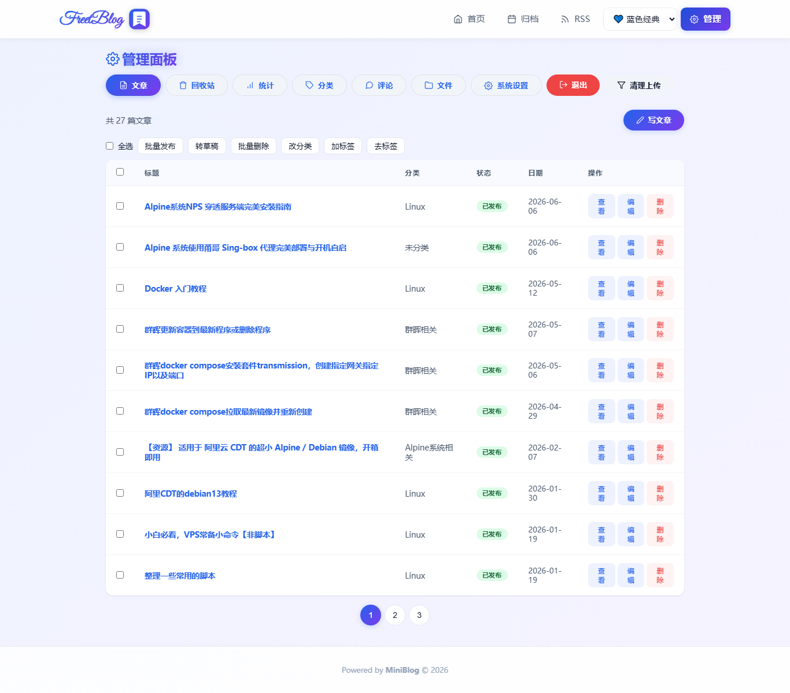

# MiniBlog 单文件版

> 一个只需上传 **1 个 PHP 文件** 即可运行的博客系统。
>
> 全部业务逻辑集中在 `index.php`；Editor.md 编辑器所需的 **39 个资源文件** 以 gzip 压缩后内嵌，**4 款网页字体** 内嵌，首次访问自动解压写入，无需单独部署任何前端资源。


---

## 📑 目录

- [项目简介](#-项目简介)
- [功能特性](#-功能特性)
- [截图](#-截图)
- [在线演示](#-在线演示)
- [环境要求](#-环境要求)
- [快速开始](#-快速开始)
- [目录结构](#-目录结构)
- [主题系统](#-主题系统)
- [字体系统](#-字体系统)
- [单文件自包含机制](#-单文件自包含机制)
- [文章缩略图](#-文章缩略图)
- [管理后台](#-管理后台)
- [页面与 API](#-页面与-api)
- [备份与恢复](#-备份与恢复)
- [安全设计](#-安全设计)
- [性能与体积](#-性能与体积)
- [常见问题 FAQ](#-常见问题-faq)
- [更新日志](#-更新日志)
- [贡献](#-贡献)
- [License](#-license)

---

## 📌 项目简介

MiniBlog 是一个把「博客前台 + 管理后台 + 编辑器 + 数据库 + 备份恢复」全部塞进单个 PHP 文件的轻量博客系统：

- **零依赖部署**：只上传 `index.php`，首次访问自动创建目录、数据库、编辑器资源与字体文件
- **数据本地化**：SQLite 单文件数据库，数据完全归你所有
- **开箱即用**：Markdown 编辑器、代码高亮、Mermaid 流程图、评论、统计、备份一应俱全
- **全端一致**：主题与字体均为服务器端全局设置，手机 / 电脑 / 访客看到的是同一个样子

---

## ✨ 功能特性

### 📝 文章

- 发布、草稿、定时发布、回收站（可恢复 / 永久删除）
- 父级 / 子级分类、标签、相关文章、私密文章访问密码（bcrypt 验证）
- 批量操作：发布、转草稿、删除、改分类、加标签、去标签
- 自动生成 Slug，可手动指定；字数 / 阅读时长统计

### ✍️ 编辑与阅读

- Editor.md Markdown 编辑器（CodeMirror 内核）
- 代码块弹窗默认语言为 **bash**，自动识别粘贴代码的语言
- 行内工具：字号、颜色、加粗 / 斜体 / 高亮 / 上下标等标签
- 表格、视频（YouTube / 本地）、图片上传
- 自动保存草稿（localStorage，7 天）
- 目录 TOC 滚动跟随、上一篇 / 下一篇、阅读进度条、图片灯箱
- highlight.js 代码高亮、Mermaid 流程图（按文章内容按需加载）

### 🎨 主题与字体

- 4 套主题：💙 蓝色经典（默认）、🌸 暖色、☀️ 亮色、🌙 深色
- 主题切换仅管理员可见，保存到服务器，**全端全局生效**
- 13 款站点字体：4 款自托管网页字体 + 9 款系统字体栈
- 网页字体内嵌于 `index.php`，手机 / 电脑显示一致

### 💬 互动

- 评论审核、回复层级、算术验证码
- 敏感词过滤、IP 黑名单、评论频率限制
- 新评论 / 新文章通知：邮件、Server酱、Telegram

### 🖼️ 媒体

- 图片自动压缩为 WebP（质量 82）、生成缩略图、去除 EXIF
- 支持图片、ZIP、二进制、文本等多种格式上传，后缀白名单可配置
- 远程图片自动下载缓存（防外链失效）
- 文件管理：真实类型筛选、引用保护、批量删除、清理未引用文件
- 头像固定保存为 `uploads/avatar.webp`，更新自动覆盖，文件管理中不可删除

### 📊 数据

- 统计看板：PV / UV、热门文章 Top 10、文章 / 标签 / 评论总数
- 完整 / 增量备份、下载 .zip、恢复 .zip / .db、远程 NAS 备份目录
- 操作日志（北京时间，可一键校准时区）

### 🔍 SEO 与安全

- sitemap.xml、robots.txt、RSS、OG 标签、JSON-LD、canonical
- 全文搜索（SQLite FTS5 trigram，不支持时自动降级 LIKE）
- 热搜词记录
- bcrypt 密码、CSRF 校验、登录限流、安全响应头

---

## 📸 截图

> 将截图放入 `screenshots/` 目录后替换以下引用。




---

## 🧭 在线演示

[演示地址](https://你的演示地址)

---

## ⚙️ 环境要求

| 项目 | 要求 |
| --- | --- |
| PHP | 7.4+ |
| 必装扩展 | `pdo_sqlite`、`zlib`（gzdecode，PHP 默认自带） |
| 推荐扩展 | `gd`（图片压缩）、`zip`（备份）、`mbstring`（中文处理） |
| 数据库 | SQLite（自动创建，无需安装） |
| Web 服务器 | Apache / Nginx / 任意支持 PHP-FPM 的服务器 |

> [!NOTE]
> `gd` 缺失时图片上传仍可用，只是不会自动转 WebP / 生成缩略图；
> `zip` 缺失时“下载备份 / 恢复 zip”不可用，但快照备份不受影响。

---

## 🚀 快速开始

### 1. 上传

将 `index.php` 上传到站点根目录，例如：

```bash
/volume1/web/blog/index.php
```

### 2. 设置权限

```bash
chmod -R 755 /volume1/web/blog
chmod -R 775 /volume1/web/blog/data
chmod -R 775 /volume1/web/blog/uploads
```

### 3. 首次访问

浏览器打开站点地址，程序自动完成：

1. 创建 `data/`、`data/backup/`、`uploads/` 目录
2. 解压内嵌的 **39 个 Editor.md 资源** 到 `editormd/`
3. 写入 **4 款网页字体** 到 `fonts/`
4. 创建 SQLite 数据库与全部数据表
5. 进入安装页，设置管理员账号与密码

### 4. 进入后台

访问 `?admin=posts` 登录管理面板。

> [!TIP]
> 全新安装默认使用「蓝色经典」主题与「网页手写体 MaShanZheng」字体，
> 手机端打开即可看到手写体效果。

---

## 📁 目录结构

```text
blog/
├── index.php        # 单文件主程序（约 2.7MB，含全部内嵌资源）
├── editormd/        # 编辑器资源（首次访问自动解压，39 个文件）
├── fonts/           # 网页字体（首次访问自动解压，4 个 woff2）
├── data/            # SQLite 数据库与备份
│   ├── blog.db      # 主数据库（WAL 模式）
│   └── backup/      # 服务器备份目录
└── uploads/         # 上传文件（图片 / 附件 / 头像）
```

> [!WARNING]
> `data/` 与 `uploads/` 内含隐私数据，请勿放入公开仓库；
> 使用 Apache 时建议在 `data/` 与 `uploads/` 内放置 `.htaccess` 禁止直接访问。

---

## 🎨 主题系统

| 主题 | 值 | 说明 |
| --- | --- | --- |
| 💙 蓝色经典 | `blue` | 默认主题，蓝 → 紫渐变 |
| 🌸 暖色 | `warm` | 柔和浅杏 → 浅粉渐变 |
| ☀️ 亮色 | `light` | 橙 → 玫红亮色 |
| 🌙 深色 | `dark` | 柔和深灰蓝 + 紫色光晕 |

### 切换方式

- 顶栏主题下拉框**仅管理员可见**（`isAdmin()`）
- 切换后写入数据库 `settings.site_theme`，**全局生效**：
  - 所有访客、所有设备（手机 / 平板 / 电脑）统一显示
  - 游客无法修改
- 浏览器标签页 Favicon 也会跟随主题变色

### 主题变量

各主题通过 CSS 变量（`--bg`、`--card`、`--t1`、`--g1`、`--g2` 等）定义，管理后台按钮、卡片、归档、文件管理汇总等全部跟随主题配色。

---

## 🔤 字体系统

### 自托管网页字体（全端一致，内嵌在 index.php）

| 选项 | 字体 | 文件 | 风格 |
| --- | --- | --- | --- |
| ✍️ 网页手写体 | MaShanZheng（马善政） | `ma-shan-zheng.woff2`（10.6KB） | 中文毛笔手写风格 |
| ✒️ 花体 | Great Vibes | `great-vibes.woff2`（29KB） | 优雅连笔花体 |
| ✒️ 花体 | Allura | `allura.woff2`（16.5KB） | 细雅连笔花体 |
| ✍️ 手写 | Dancing Script | `dancing-script.woff2`（15KB） | 活泼手写体 |

> [!IMPORTANT]
> 当前内嵌的网页字体为 **ASCII 子集**（英文、数字、常用符号），
> 站点名称为中文时不会命中这些字体，会自动回退到系统字体。
> 如需中文手写体覆盖，请使用「全量中文版」重新生成。

### 系统字体栈（随设备变化）

手写体 Segoe Script、古典花体 Monotype Corsiva、手写印刷 Segoe Print、圆润卡通 Comic Sans、签名花体 Lucida Handwriting、典雅花体 Edwardian Script、衬线体、楷体、现代无衬线，共 9 款。

### 生效位置

- 页头站点名称（Logo）
- 作者卡片回退名称
- 无图文章的渐变缩略图文字（内联 SVG）

字体设置同样保存在服务器数据库 `settings.site_font`，**全端全局生效**；
全新安装默认值为 `web`（网页手写体）。

---

## 🧩 单文件自包含机制

`index.php` 体积构成（约 2.7MB）：

| 部分 | 大小 | 说明 |
| --- | --- | --- |
| 程序逻辑（PHP + CSS + JS） | 约 270KB | 全部业务代码 |
| 编辑器资源（39 个文件） | 约 2.36MB | gzip 压缩后 Base64 内嵌 |
| 网页字体（4 个 woff2） | 约 0.1MB | ASCII 子集 Base64 内嵌 |

### 自动解压与自愈

```text
首次访问 / 文件缺失
        │
        ▼
ensureEditorAssets() ──► 解压 gzip 资源到 editormd/
ensureSiteFont()     ──► 解压字体到 fonts/
        │
        ▼
文件已存在且大小正常 ──► 跳过（不重复写入）
```

- 检测条件：文件不存在或小于阈值时自动重建
- 支持 gzip 解压（`gzdecode`），缺失时自动降级 `gzinflate`
- 即使部署后误删某个资源文件，下一次访问也会自动修复

### 内嵌资源清单（39 个）

`editormd.min.js`、`editormd.min.css`、FontAwesome 字体（woff2/woff/ttf/eot/svg）、EditorMD Logo、加载动画、CodeMirror（css/js/modes/addons）、marked、prettify、raphael、underscore、flowchart、sequence-diagram、highlight.js、highlight 主题、mermaid、语言包、5 个编辑器插件、`jquery-1.12.4.min.js`、`font-awesome.min.css`。

---

## 🖼️ 文章缩略图

- 文章有图片：自动使用首图（有 `thumb_` 缩略图时优先）
- 文章无图片：按标题哈希生成**渐变抽象 SVG**，站名文字使用当前站点字体
- 缩略图为**内联 SVG**（不是 `` 图片），因此可以直接使用页面加载的网页字体
- 浏览器限制说明：SVG 作为图片引用时不能加载外部字体，所以内联是唯一能“让图片文字用手写体”的实现方式

---

## 🔧 管理后台

### 导航

📝 文章 · 🗑️ 回收站 · 📊 统计 · 📂 分类 · 💬 评论 · 📁 文件 · ⚙️ 系统设置

### 系统设置（双列布局卡片）

| 卡片 | 内容 |
| --- | --- |
| 站点信息 | 站点名称、描述、页脚版权、站点字体 |
| 作者信息 | 作者名称、简介、头像（固定 `avatar.webp`） |
| 备份与恢复 | 服务器备份目录、立即备份、备份列表（默认收起）、下载 / 恢复 |
| 管理员密码 | 修改后台密码（bcrypt） |
| 上传设置 | 单文件大小上限（MB，0 = 不限制）、允许的后缀白名单 |
| 操作日志 | 最近操作记录，再次点击收起 |

### 文件管理

- 顶部汇总：文件数、占用空间、单文件上限、未引用数量
- 按真实扩展名筛选（PNG / JPEG / ZIP / WEBP / 二进制等）
- 引用中的文件（如头像 `avatar.webp`）**不可删除、不可勾选**，服务端同样拦截
- 批量删除、清理未引用文件

---

## 📡 页面与 API

### 前台页面

| 地址 | 说明 |
| --- | --- |
| `/?` | 首页（分类、标签、最新文章、热门搜索） |
| `/?slug=xxx` | 文章页（TOC、评论、上一篇 / 下一篇） |
| `/?archive=1` | 归档页 |
| `/?cat=1` / `/?tag=xxx` | 分类 / 标签筛选 |
| `/?action=rss` | RSS 2.0 |
| `/?action=sitemap` | sitemap.xml |
| `/?action=robots` | robots.txt |
| `/?action=favicon` | 主题跟随 SVG Favicon（`&png=1` 输出 PNG） |
| `/?action=manifest` | PWA Manifest |

### 主要 API

| 接口 | 说明 |
| --- | --- |
| `?action=posts` | 文章列表（分页 / 分类 / 标签 / 搜索） |
| `?action=post` | 文章详情（含密码校验） |
| `?action=comment` | 提交评论（POST） |
| `?action=categories` / `tags` | 分类 / 标签数据 |
| `?action=hot_searches` | 热搜词 |
| `?action=check` | 登录状态 / 安装状态 |
| `?action=login` / `logout` | 登录 / 退出 |
| `?action=admin_*` | 后台管理接口（全部要求管理员 + CSRF） |
| `?action=admin_set_theme` | 保存全局主题（POST） |
| `?action=admin_settings` | 保存站点 / 作者 / 上传 / 密码等设置 |
| `?action=admin_upload` | 图片 / 附件上传 |
| `?action=admin_backup*` | 备份、下载、恢复、NAS 目录管理 |

---

## 💾 备份与恢复

- **立即备份**：生成服务器快照（数据库 + 上传文件 + 程序文件），可指定 NAS 目录
- **下载备份**：`.zip` 完整包
- **恢复**：上传 `.zip` / `.db`，或从服务器快照列表直接恢复
- **自动兜底**：超过 24 小时无备份时，以低频随机方式在访问请求中自动备份一次
- 备份列表默认收起，可展开查看历史快照

> [!CAUTION]
> 恢复操作会覆盖当前数据，请先下载一份当前备份再操作。

---

## 🔒 安全设计

- 管理员密码 bcrypt 存储，登录 15 分钟内最多尝试 5 次
- 所有写操作带 CSRF Token 校验
- 评论：算术验证码、IP 频率限制（5 条 / 5 分钟）、敏感词过滤、黑名单
- 上传：后缀白名单、大小限制、图片重编码（去 EXIF / 转 WebP）、文件名处理
- 输出：`htmlspecialchars` 全局转义；Markdown 标签白名单
- 响应头：`X-Content-Type-Options`、`X-Frame-Options`、`Referrer-Policy`、`Permissions-Policy`
- 私密文章密码仅存 bcrypt 哈希，解锁状态存会话

---

## ⚡ 性能与体积

- 单文件 2.7MB，部署、备份、迁移只需复制一个文件
- 编辑器资源 gzip 压缩内嵌，PHP 解析负担远小于原始 7MB 版本
- 公共页面按需加载：游客不加载 Editor 脚本；Mermaid 仅文章包含流程图时加载
- SQLite WAL 模式 + `busy_timeout=5000`，小流量下零维护
- 全文搜索优先 FTS5（trigram），不支持时自动降级 LIKE
- 页面 HTML 使用 `no-store`，API 均为轻量 JSON

---

## ❓ 常见问题 FAQ

### 手机端字体没生效？

字体是服务器端全局设置。请在后台「系统设置 → 站点字体」选择后点击**保存站点设置**，然后手机强刷（或清除该站点缓存）一次。

### 主题切换后手机端没变？

主题已全局化（存储于服务器）。管理员在任意设备切换后，所有访客设备统一生效；游客不能切换主题。

### 全新部署后 `fonts/` 只有一个字体？

请确认使用的是最新版 `index.php`（旧版存在一处字体声明被注释吞掉的问题，新版已修复）。最新版会自动解压全部 4 个字体，且删除后会自动重建。

### 缩略图上的文字还是普通字体？

缩略图文字使用「站点字体」。若站点名称为中文，而当前选择的是英文网页字体（ASCII 子集），会回退到系统字体；请改用支持中文的方案或系统楷体。

### 上传大小限制怎么改？

后台「上传设置」填写 MB 数，填 `0` 表示不限制（实际受服务器 `upload_max_filesize` / `post_max_size` 约束）。代码内置上限为 10240MB。

### 备份文件很多，可以删吗？

可以。服务器上的 `index.php.bak-*` 是部署时的自动备份，建议保留最近 1–2 份，其余可删除。

### 图片上传后没有压缩？

检查 PHP 是否启用 `gd` 扩展；`imagewebp` 不可用时会保留原图。

### 修改代码后页面没变化？

强制刷新（Ctrl + F5 / 手机清除缓存）。若服务器开启了 OPcache 且关闭了时间戳校验，需要重启 PHP-FPM 或等待缓存过期。

---

## 📝 更新日志

### 2026-08-03 · 单文件压缩版 v1.0

- 编辑器资源（39 个文件）gzip 压缩后内嵌，文件从 7MB 降至 2.7MB
- 4 款网页字体（MaShanZheng / Great Vibes / Allura / Dancing Script）内嵌，全新部署自动解压
- 修复字体声明被注释吞掉导致新站点只解压 1 个字体的问题（自愈验证通过）
- 主题改为服务器端全局设置，手机 / 访客全端生效
- 新增主题跟随 Favicon（SVG + PNG）
- 文章缩略图改为内联 SVG，可直接使用网页字体
- 补齐内嵌清单缺失的 jquery 与 font-awesome.min.css
- 全新安装默认字体改为网页手写体

---

## 🤝 贡献

欢迎提交 Issue 和 Pull Request：

```bash
git checkout -b feature/xxx
git commit -m "feat: xxx"
git push origin feature/xxx
```

---

## 📄 License

- 程序代码：MIT License（见 `LICENSE` 文件）
- 内嵌字体：SIL Open Font License 1.1
  - Ma Shan Zheng（马善政）
  - Great Vibes
  - Allura
  - Dancing Script

可自由使用、修改与商用，分发时请保留字体版权声明。
